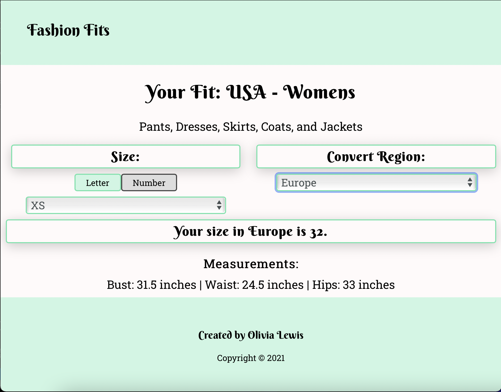

# Fashion Fits API

This App allows users to find their clothing size in several countries and measurement types.

Live App: [Fashion Fits](https://fashion-fits.vercel.app/)

Client Repo: [Fashion Fits Repo](https://github.com/ollythedeveloper/fashion-fitsi)

## Screenshots

Landing Page:

Convert/Result Page:

# Set up

Complete the following steps to set up locally:

1. Clone this repository to your local machine 
2. `cd` into the cloned repository and run npm install
3. Create the dev and test databases (`fashion-fits` and `fashion-fits-test`)
4. Update the `.env` with your local variables
5. Run the migrations for dev `npm run migrate`
6. Run the migrations for test `npm run migrate:test`
7. Seed the dev database with each of the files located in the seed folder `psql -U <db-user> -d fashion-fits -f ./seeds/<file>`
8. Run the test to make sure everything is working properly `npm t`
9. Start the app `npm run dev`

# REST API

The REST API to Fashion Fits is described below.

Scheme: HTTPS

## Get list of ProfileTypes

### Request

`GET /profileTypes/`  

get list of all the profileTypes

### Responses

**Code - Description**

200 OK

401 Unauthorized 

Response Content-Type: application/json

## Add a new ProfileType

### Request

`POST /profileTypes/`  

profileType that needs to be added to the store

Example Value: 

{

    "id": 0,
    "name": "profileTypes name",
    "bust": [1, 2, 3, 4, 5, 6, 7],
    "waist": [1, 2, 3, 4, 5, 6, 7],
    "hips": [1, 2, 3, 4, 5, 6, 7]

}

Parameter Content Type: application/json

### Responses

**Code - Description**

201 Created

400 Bad Request

401 Unauthorized 

Response Content-Type: application/json

---

Technology Used
---------------
* Node
* Express
* Postgres