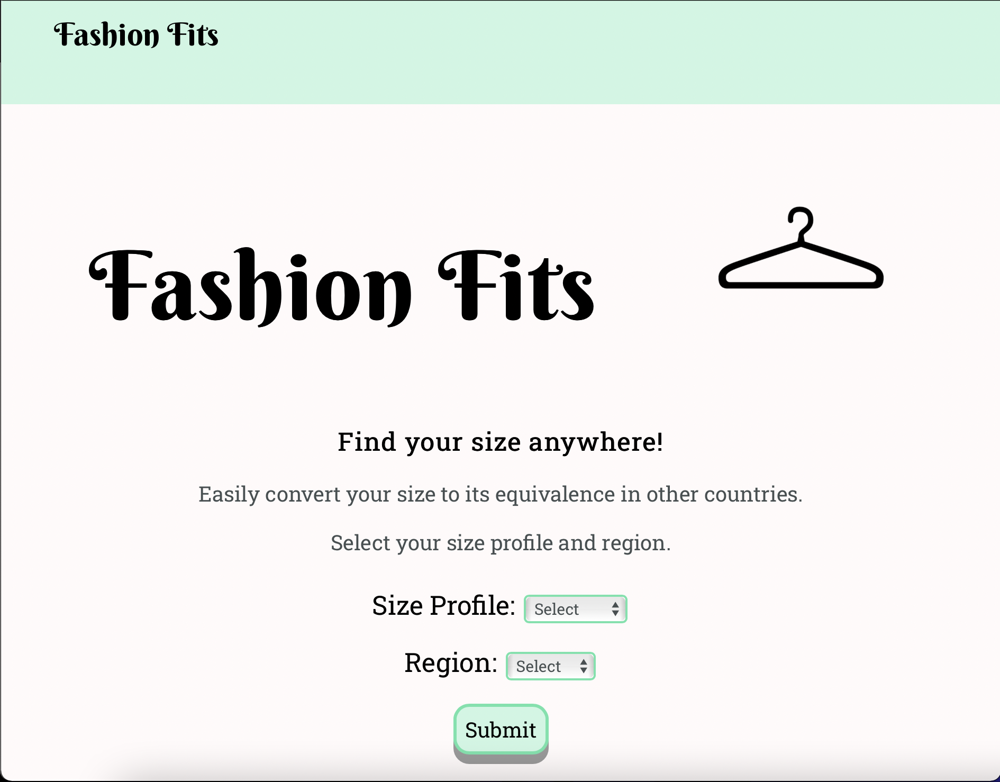

# Fashion Fits API

This App allows users to find their clothing size in several countries and measurement types.

Live App: [Fashion Fits](https://fashion-fits.vercel.app/)

Client Repo: [Fashion Fits Repo](https://github.com/ollythedeveloper/fashion-fitsi)

## Screenshots

Landing Page:

Convert/Result Page:

# Set up

Complete the following steps to set up locally:

1. Clone this repository to your local machine 
2. `cd` into the cloned repository and run npm install
3. Create the dev and test databases (`fashion-fits` and `fashion-fits-test`)
4. Update the `.env` with your local variables
5. Run the migrations for dev `npm run migrate`
6. Run the migrations for test `npm run migrate:test`
7. Seed the dev database with each of the files located in the seed folder `psql -U <db-user> -d fashion-fits -f ./seeds/<file>`
8. Run the test to make sure everything is working properly `npm t`
9. Start the app `npm run dev`

# REST API

The REST API to Fashion Fits is described below.

Scheme: HTTPS

## ProfileTypes

`GET /profileTypes/`  Get a list of all the profileTypes

### Responses

**Code - Description**

200 OK

401 Unauthorized 

Response Content-Type: application/json

`POST /profileTypes/`  Creates a new profileType

Example Value: 

{

    "id": 0,
    "name": "profileTypes name",
    "bust": [1, 2, 3, 4, 5, 6, 7],
    "waist": [1, 2, 3, 4, 5, 6, 7],
    "hips": [1, 2, 3, 4, 5, 6, 7]

}

Parameter Content Type: application/json

### Responses

**Code - Description**

201 Created

400 Bad Request

401 Unauthorized 

Response Content-Type: application/json

`GET /profileTypes/{profileTypeId}`  Find profileType by ID

### Responses

**Code - Description**

200 OK

401 Unauthorized 

404 Not Found

Response Content-Type: application/json

`DELETE /profileTypes/{profileTypeId}`  Delete profileType by ID

### Responses

**Code - Description**

204 No Content

401 Unauthorized 

404 Not Found

Response Content-Type: application/json

`PATCH /profileTypes/{profileTypeId}`  Update an existing profileType by ID

Example Value: 

{

    "name": "Updated profileType name"

}

### Responses

**Code - Description**

204 No Content

400 Bad Request

401 Unauthorized 

404 Not Found

Response Content-Type: application/json

---

## Regions

`GET /regions/`  Get a list of all the regions

### Responses

**Code - Description**

200 OK

401 Unauthorized 

Response Content-Type: application/json

`POST /regions/`  Creates a new region

Example Value: 

{

    "id": 0,
    "country": "Country name"

}

Parameter Content Type: application/json

### Responses

**Code - Description**

201 Created

400 Bad Request

401 Unauthorized 

Response Content-Type: application/json

`GET /regions/{regionId}`  Find region by ID

### Responses

**Code - Description**

200 OK

401 Unauthorized 

404 Not Found

Response Content-Type: application/json

`DELETE /regions/{regionId}`  Delete region by ID

### Responses

**Code - Description**

204 No Content

401 Unauthorized 

404 Not Found

Response Content-Type: application/json

`PATCH /regions/{regionId}`  Update an existing region by ID

Example Value: 

{

    "country": "Updated country name"

}

### Responses

**Code - Description**

204 No Content

400 Bad Request

401 Unauthorized 

404 Not Found

Response Content-Type: application/json

---

## Profiles

`GET /profiles/`  Get a list of all the profiles

### Responses

**Code - Description**

200 OK

401 Unauthorized 

Response Content-Type: application/json

`POST /profiles/`  Creates a new profile

Example Value: 

{

    "id": 0,
    "profiletype_id": 0,
    "region_id": 0,
    "fit": "profile fit",
    "category": "profile category",
    "number_sizes": ["1", "2", "3", "4", "5", "6", "7"],
    "results": "profile results"

}

Parameter Content Type: application/json

### Responses

**Code - Description**

201 Created

400 Bad Request

401 Unauthorized 

Response Content-Type: application/json

`GET /profiles/{profileId}`  Find profile by ID

### Responses

**Code - Description**

200 OK

401 Unauthorized 

404 Not Found

Response Content-Type: application/json

`DELETE /profiles/{profileId}`  Delete profile by ID

### Responses

**Code - Description**

204 No Content

401 Unauthorized 

404 Not Found

Response Content-Type: application/json

`PATCH /profiles/{profileId}`  Update an existing profile by ID

Example Value: 

{

    "fit": "Updated profile fit"

}

### Responses

**Code - Description**

204 No Content

400 Bad Request

401 Unauthorized 

404 Not Found

Response Content-Type: application/json
___ 

## Technology Used
* Node
* Express
* Postgres